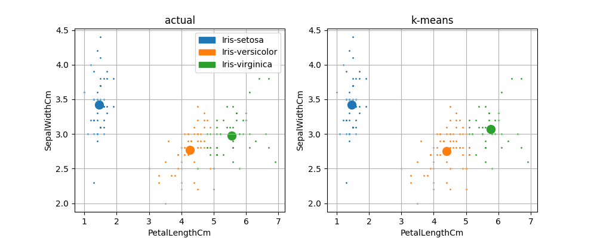

This is a simple implementation of the k-means clustering algorithm, along with a wrapper script which runs the algorithm on pre-labelled data and produces a summary and plot of the results.

Here it's applied to [the famous iris dataset](https://www.kaggle.com/uciml/iris):

```
python kmeans.py iris.csv --features SepalLengthCm,PetalWidthCm --plot-file images/sepal-length--petal-width.png
```


```
python kmeans.py iris.csv --features PetalLengthCm,PetalWidthCm --plot-file images/petal-length--petal-width.png
```


```
python kmeans.py iris.csv --features PetalLengthCm,SepalWidthCm --plot-file images/petal-length--sepal-width.png
```

